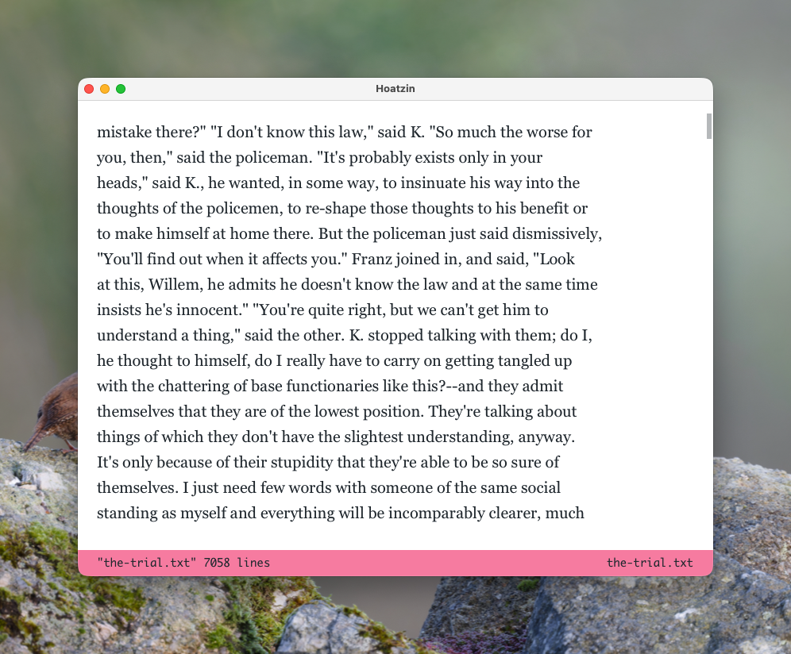

# Hoatzin

A small modal text editor for macOS, written in [Jolt](https://github.com/jolt-lang), with SDL3 for the window and CoreText for text.



## Features

- Normal and insert modes, with a `:` command line (`:open`, `:write`, `:save`, `:quit`, `:buffers`, `:new`, `:close`, `:revert`, `:cd`, `:mode`, `:settings`)
- Multiple buffers
- Wrapped text, input-method composition, smooth scrolling
- Settings window (`:settings`) for the editor and UI fonts and the theme, saved as you change them

## Requirements

- macOS
- [Jolt](https://github.com/jolt-lang)
- SDL3 (`brew install sdl3`)

## Running

```
jolt -m hoatzin.core
```

## Modes

As in Emacs, each buffer can be in a mode, which decides how its file is read and written, and can add commands or rebind normal mode's keys. Modes are Clojure, evaluated by [SCI](https://github.com/babashka/sci) outside the editor: see `src/hoatzin/app/modes.clj` for what a mode is.

A file takes the mode for its extension as it is opened or saved; `:mode name` chooses one (`:mode text` for none). The editor's own modes are in `resources/modes`:

- **auk**, for `.auk` files: notes kept as EDN. Each string of `:content` is a line of the text, and each `{:type :section :ref id}` a section from `:sections`, shown as a box of text of its own:

  ```clojure
  {:content  ["A line." {:type :section :ref 1} "Another."]
   :sections [{:id 1 :content "In a box."}]}
  ```

  In normal mode, `cmd+s` adds a section below the line and moves into it, and `cmd+k` deletes the section the caret is in, once you answer `y`. Up and down move into and out of sections, a section shows ten lines and scrolls past that, and clicking its header folds it.

Your own go in `modes` in `hoatzin` under `$XDG_CONFIG_HOME`, one `.clj` file each.

## Settings

Settings are saved to `settings.json` in `hoatzin` under `$XDG_CONFIG_HOME` (`~/.config` by default).

## Tests

```
jolt -M:test                          # everything
jolt -M:test -e :integration          # unit tests only
jolt -M:test -i :integration          # golden-image tests only
UPDATE_GOLDEN=1 jolt -M:test -i :integration   # regenerate the goldens
```
